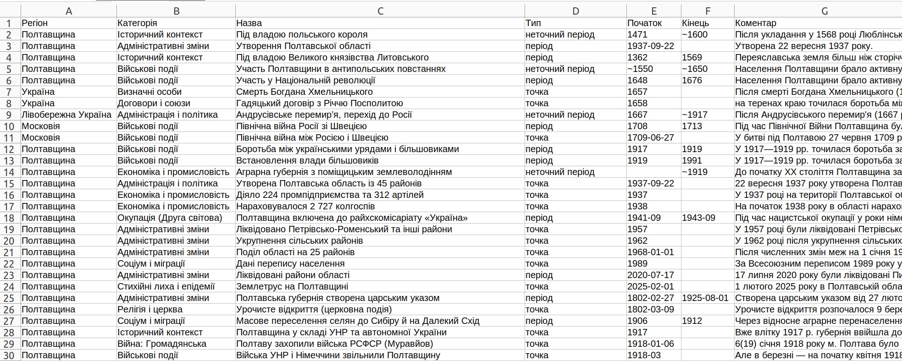

# 🇺🇦 Історична хронологія подій (Україна)

Вебзастосунок для інтерактивного перегляду історичних подій, що відбувалися на території України.

🟢 **Живе демо:**  
[https://jurchello.github.io/ua-historical-context/](https://jurchello.github.io/ua-historical-context/)

---

## 🧩 Можливості

- 🔍 Фільтрація подій за роками, регіонами, категоріями та ключовими словами
- 📊 Візуалізація подій у вигляді хронологічної шкали
- 🧠 Підтримка різних типів подій:
    - **точка** — одна дата
    - **період** — від початку до кінця
    - **між датами** — діапазон із невизначеними межами
    - **неточний період** — приблизні дати (із тильдою `~`)
- 💾 Завантаження даних з CSV-файлу (`chart.csv`)
- 📱 Адаптивний інтерфейс (Bootstrap 5)

---

## 🗂 Структура репозиторію
ua-historical-context/

├── index.html # Основна HTML-сторінка

├── chart.csv # CSV-файл із подіями (вхідні дані)

└── README.md # Опис проєкту

---

## 📥 Формат CSV (chart.csv)

Структура файлу продемонстрована на скриншоті нижче:

## 📅 Правила введення дат

У полях **`Початок`** та **`Кінець`** вказуються роки в одному з таких форматів:

## 🖼 Відображення подій за типом

| Тип               | Початок  | Кінець     | Як виглядає на сторінці                                                    |
|-------------------|----------|------------|-----------------------------------------------------------------------------|
| точка             | 1648     | (порожньо) | Одна зелена клітинка на відповідний рік                                    |
| точка             | ~1650    | (порожньо) | Одна клітинка з символом ≈ (блакитний текст на зеленому фоні)              |
| період            | 1917     | 1921       | Суцільна зелена смуга між роками                                           |
| період            | ~1917    | 1921       | Початкова клітинка з ≈, далі зелена смуга                                  |
| період            | 1917     | ~1921      | Зелена смуга, остання клітинка з ≈                                         |
| неточний період   | ~1500    | ~1550      | Жовта смуга з символами ≈ на краях                                         |
| між датами        | 1600     | 1700       | Смужка з косими жовтими штрихами (фон білий, штрихований)                  |

## 🚀 Як запустити проєкт

Є кілька способів почати користуватись проєктом:

---

### ✅ 1. Онлайн-версія (нічого встановлювати не потрібно)

Просто відкрий сайт за посиланням:  
👉 **[https://jurchello.github.io/ua-historical-context/](https://jurchello.github.io/ua-historical-context/)**

---

### 🔁 2. Форк (копія у власний GitHub-акаунт)

1. Натисни кнопку **"Fork"** у верхньому правому куті на сторінці репозиторію  
   [https://github.com/jurchello/ua-historical-context](https://github.com/jurchello/ua-historical-context)
2. У твоєму акаунті створиться власна копія репозиторію
3. Можеш редагувати `chart.csv`, змінювати сайт і розгортати його через GitHub Pages

---

### 📩 3. Пропозиція нових подій до хронології

Хочеш запропонувати події до таблиці?

1. Створи [Issue у репозиторії](https://github.com/jurchello/ua-historical-context/issues/new)
2. У ньому коротко опиши:
    - Назву події
    - Дати (початок / кінець)
    - Регіон, категорію, тип
    - Додай коментар (за бажанням)
3. Я оновлю `chart.csv` і додам подію на сайт

> ✍️ **Будь ласка, вказуй дані в такому форматі, як у прикладах CSV.**  